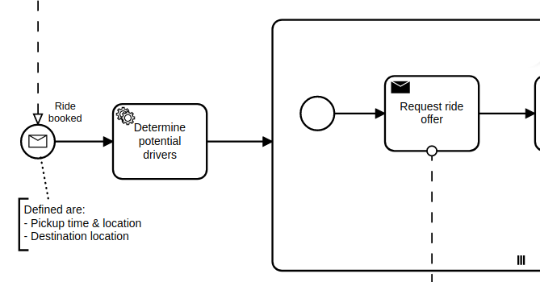

# Taxi Ride Blueprint for Business-Processing (Micro)Services

As a [consulting company](#noteworthy-contributors) we supported a lot of people bringing BPMN into their companies using the BPMN engine [Camunda 7](https://docs.camunda.com). As Camunda introduced their new major release [Camunda 8](https://docs.camunda.io) in April 2022 we built this Blueprint to support users of Camunda on their way from Camunda 7 to 8. Since the new release has a complete new API the Blueprint follows the advice of Camunda to [separate the business logic from the engine's API](https://docs.camunda.io/docs/guides/migrating-from-camunda-platform-7/#prepare-for-smooth-migrations) by introducing an aspect oriented [service programming interface (SPI)](./spi/README.md).

More than this, this Blueprint is for developing Java based business process driven (micro)services. We do this by a sample workflow about processing a taxi ride. You can use it to build your own application by either clone and adopt the taxi ride or by using the underlying modules as Maven dependencies. **The Blueprint should help you building maintainable business processing (micro)services with minimal afford**.

*If you are not familiar with BPMN:* BPMN is a graphical representation for specifying business processes in XML also including semantic information. A BPMN engine runs those processes and acts as a state engine. This helps to dramatically reduce the amount of code since only "tasks" need to be implemented and the flow is handled by the engine. Hang on to see this in action.

## Content

1. [How it looks like](#how-it-looks-like)
1. [Motivation](#motivation)
1. [Goals](#goals)
1. [Prerequisites](#prerequisites)
1. Modules provided:
     1. **[SPI](./spi/README.md): Service programming interface for BPMS.**
     1. [Camunda Platform 7 adapter](./adapters/camunda7/README.md)
     1. [Camunda Platform 8 adapter](./adapters/camunda8/README.md)
     1. Additional support for building services:
         1. [Spring Boot multi workflow module support](./adapters/spring-boot/README.md)
         1. [REST client support](./adapters/rest/README.md)
     1. A full fledged example ["Taxi Ride"](./taxi/README.md) to show how the Blueprint looks like applied to a real-world scenario.
1. [Noteworthy & Contributors](#noteworthy-contributors)
1. [License](#license)

## How it looks like

This is a section of a taxi ride workflow and should give you an idea of how the Blueprint SPI is used in your business code:



```java
@Service
@WorkflowService(workflowAggregateClass = Ride.class)
@Transactional(noRollbackFor = TaskException.class)
public class TaxiRide {
    
    @Autowired
    private ProcessService<Ride> processService;
    
    public String rideBooked(
            final Location pickupLocation,
            final OffsetDateTime pickupTime,
            final Location targetLocation) {
        
        final var ride = new Ride();
        ...
        // start the workflow by correlation of the message start event
        return processService
                .correlateMessage(ride, "RideBooked")
                .getRideId();
    }
    
    @WorkflowTask
    public void determinePotentialDrivers(
            final Ride ride) {
        
        final var parameters = new DriversNearbyParameters()
                .longitude(ride.getPickupLocation().getLongitude())
                .latitude(ride.getPickupLocation().getLatitude());

        final var potentialDrivers = driverService
                .determineDriversNearby(parameters);

        ride.setPotentialDrivers(
                mapper.toDomain(potentialDrivers, ride));
    }

    @WorkflowTask
    public void requestRideOfferFromDriver(
            final Ride ride,
            @MultiInstanceIndex("RequestRideOffer")
            final int potentialDriverIndex) {
        
        final var driver = ride.getPotentialDrivers().get(potentialDriverIndex);
        
        driverService.requestRideOffer(
                driver.getId(),
                new RequestRideOfferParameters()
                        .rideId(ride.getRideId())
                        .pickupLocation(mapper.toApi(ride.getPickupLocation()))
                        .pickupTime(ride.getPickupTime())
                        .targetLocation(mapper.toApi(ride.getTargetLocation())));
        
    }
    ...
```

For more details read each module's description link in the [content](#content) section.

## Motivation

Each BPMN engine, also called Business Processing Management System (BPMS) or workflow system, has its own APIs. Using a BPMS requires a developer to know the API and also to understand its paradigms. Typically, the API is not completely decoupled from the runtime environment which means that things like transactional behavior, synchronization of concurrent executions and similar has to be controlled by the business code but also effects the behavior of the BPMS.

So, the API *bleeds* into the business code and the business code effects the API what leads to:

- The BPMS' API is interwoven with the business code.
- All developers need to know about the APIs and their rules.
- The business code is less readable and therefore harder to maintain.
- Moving to other technology stacks/APIs (like from Camunda 7 to Camunda 8) requires to reimplement the business logic.

## Goals

To deal with the problems mentioned we decided to define **an SPI (service programming interface) for workflow systems as a we would expect it to be**. This SPI incorporates best-practices collected as part of developing business-processing services since 2014 using various of those system. The provided implementation of the SPI is called adapter and hides all the details of the workflow system API. This lets the developer focus on the business aspects rather than technical details.

As evidence we provide adapters for some Camunda 7 and Camunda 8 as well as optional support for workflow modules in a microservice environment. The implementation is based on [Spring boot](https://spring.io/projects/spring-boot) but can be adopted to JEE as well.

## Prerequisites

You should know about [BPMN](https://en.wikipedia.org/wiki/Business_Process_Model_and_Notation) and you should be able to create meaningful models using a [modeler tool](https://camunda.com/en/download/modeler/). You also need to be able to work with the tool-stack of the Blueprint: Java, Spring Boot and  Maven.

## Noteworthy & Contributors

This Taxi Ride Blueprint was developed by [Phactum](https://www.phactum.at) with the intention of giving back to the community as it has benefited the community in the past.


Special thanks go to Martin Schimak, [plexiti GmbH](https://plexiti.com/).
Some aspects that were introduced, in particular DDD concepts, have their origin in the long-term cooperation with him as a partner of Phactum.

## License

Apache License, Version 2.0
