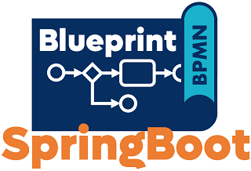

# Blueprint for Business-Processing (Micro)Services

Each Business Processing Management System (BPMS) has its own rules of how to be used and its own paradigms implemented. Using a BPMS requires a developer to be aware of those rules and also to use its APIs which typically reflect the technology used by the implementation of the BPMS.

All these rules and technologies *bleed* into the business code and lead to:

- The BPMS' technology is interwoven with the business code.
- All developers need to know about those rules and APIs mentioned.
- The business code is less readable and therefore harder to maintain.
- Moving to other technology stacks requires to reimplement the business logic.

To deal with this we decided to define **a SPI (service programming interface) for BPMS as a Java developer would expect it to be**. This SPI incorporates best-practices collected as part of developing business-processing services since 2014 using various BPMSs. We also used a lot of domain-driven design paradigms since they are a good fit to build a simple SPI.

As evidence we provide adapters for some BPMS as well as support for workflow modules in a microservice environment. The implementation is based on [Spring boot](https://spring.io/projects/spring-boot) but can be adopted to JEE as well.

All parts together form a **Blueprint** which should help you **building** maintainable business processing (micro)**services with minimal afford**.

## Content

1. An extremly simplified and pure Java [SPI](./spi/README.md) to hide BPMS characteristics. 
1. Several [adapters](./adapters/README.md) which bind the SPI to BPMSs like:
   1. [Camunda Platform 7](./adapters/camunda7/README.md)
   1. [Camunda Platform 8](./adapters/camunda8/README.md)
1. Additional support for building microservices:
   1. [Spring Boot multi workflow module support](./adapters/spring-boot/README.md)
   1. [REST client support](./adapters/rest/README.md).
1. A [sample](./blueprint/README.md) used to test all features with various BPMSs
1. A full fledged example ["Taxi Ride"](./taxi/README.md) to show how the Blueprint looks like applied to a real-world scenario.

## Example

These example, which is a section of a taxi ride worfklow, should give you an idea of how this SPI is used:


```java
@Service
@WorkflowService(workflowAggregateClass = Ride.class)
@Transactional(noRollbackFor = TaskException.class)
public class TaxiRide {
    
    @Autowired
    private ProcessService<Ride> processService;
    
    public String rideBooked(
            final Location pickupLocation,
            final OffsetDateTime pickupTime,
            final Location targetLocation) {
        
        final var ride = new Ride();
        ...
        // start the workflow by correlation of the message start event
        return processService
                .correlateMessage(ride, "RideBooked")
                .getRideId();
    }
    
    @WorkflowTask
    public void determinePotentialDrivers(
            final Ride ride) {
        
        final var parameters = new DriversNearbyParameters()
                .longitude(ride.getPickupLocation().getLongitude())
                .latitude(ride.getPickupLocation().getLatitude());

        final var potentialDrivers = driverService
                .determineDriversNearby(parameters);

        ride.setPotentialDrivers(
                mapper.toDomain(potentialDrivers, ride));
    }

    @WorkflowTask
    public void requestRideOfferFromDriver(
            final Ride ride,
            @MultiInstanceIndex("RequestRideOffer")
            final int potentialDriverIndex) {
        
        final var driver = ride.getPotentialDrivers().get(potentialDriverIndex);
        
        driverService.requestRideOffer(
                driver.getId(),
                new RequestRideOfferParameters()
                        .rideId(ride.getRideId())
                        .pickupLocation(mapper.toApi(ride.getPickupLocation()))
                        .pickupTime(ride.getPickupTime())
                        .targetLocation(mapper.toApi(ride.getTargetLocation())));
        
    }
    ...
```

For more details read each module's description link in the [content](#content) section.

## Noteworthy & Contributors

This Blueprint was developed by [Phactum](https://www.phactum.at) with the intention of giving back to the community as it has benefited the community in the past.


Some aspects that were introduced, in particular DDD concepts, have their origin in the long-term cooperation with our partner [plexiti](https://plexiti.com/), who is also actively involved.


## License

Apache License, Version 2.0
