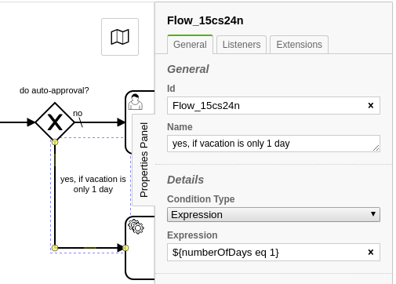
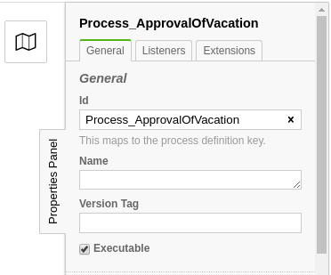
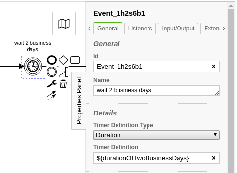
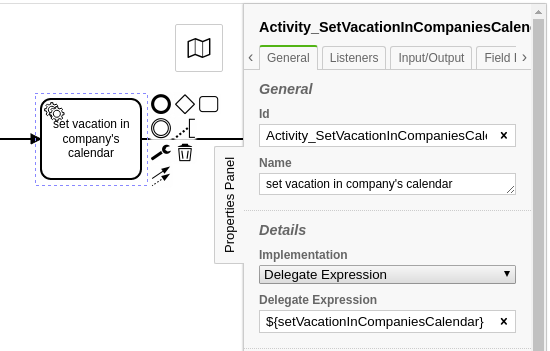

# Domain Dervice Design

This module is about using DDD patterns to simplify business-process applications. Additionally, a lot of loose-coupling techniques are used to minimize the weaving between the BPMN and the software.

## Concept

The base idea is to have ***ONE*** service-bean which is responsible for all needs of a business-process. If several services or external-components are required then this single service is a frontend for all of them.

In terms of BPMN there are tasks (e.g. service-task, send-task, etc.) which are wired to methods of that service by name and there are expressions (e.g. conditional-flows) which are evaluated agains a process-specific [domain-aggregate](https://martinfowler.com/bliki/DDD_Aggregate.html).

This aggregate uses a natural id as a primary key, so for one specific natural key a particular process started twice is identified as a duplicate and rejected.

## Usage

### Natural ids

A natural id is a primary key which uniquly identifies a single business-case. That might be an order-id, a trouble-ticket-id or - as in the case of vacation-requests - an artificial identifier (auto-increment/UUID).

This natural id has to be choosen wisely, because it is used to identify duplicate requests, which might occure in a distributed, fault-tolerant system.

### Process-specific domain-aggregate

A process-engine might give you the ability to use process-variables to store information the workflow needs to fulfill decisions like sequence-flow conditions. This blueprint does not use process-variables but introduces a seperate JPA entity as a DDD aggregate for each process:

```java
@Entity
@Table(name = "APPROVALS_OF_VACATION")
@Getter
@Setter
public class ApprovalOfVacation extends WorkflowDomainEntity {
  private int numberOfDays;
  private String 
}
```

This JPA-entity is used to store all the values used by this one particular business-process. This entity might be split up into a couple of entities (many-to-many, one-to-many, many-to-one relations and embedded objects) but the root of that tree is the record connected with a workflow.

Instead of using process-variables the entity's properties can be used in the process e.g. for conditional sequence-flows:



Reasons for not using process-variables:

1. BPMN
   1. Process-variables have no schema and therefore it can be documented and tested for
   1. Using a domain-entity gives you a schema which can be used as a contract between business people and developers
   1. Type-safety of the information needed by the process
1. Operation of workflows
   1. Historic process-variables needs to be cleaned up which might exhauste your database
   1. Process-variables polute the execution-context because typically they are not cleaned up by the developers
   1. As a default *all* process-variables are copied in the case of call-activities
   1. Schema evolution: The variables may be of complex types which may evolve over the time. Migrating those values is a hard job. 

There are some base-requirements for domain-aggregates used for workflows:

1. It has to use a natural id as primary key
1. It has to store the exact version of process the workflow is started with

The blueprint-framework simplifies a couple of things in conjunction with this workflow-aggregate-entity by providing a base-class `at.phactum.bp.blueprint.domain.WorkflowDomainEntity` (see example above).

### Wire up a process

Acording to the [concept](#Concept) and in order to have no reference from BPMN to the implemenation an aspect-oriented approach is used for the binding.

There are two primary use-case for this:
1. Whenever a value needs to be calculated (e.g. x business-days as a timer-event definition)
1. Whenever a task needs to fulfill its functionality (e.g. service-task)

In both cases a method needs to be called (1. to calculate a value; 2. to complete a task). Those methods will be lookup up in a service-bean which is bound to a particular process (and process version) and its workflow-aggregate-entity.

As a basis for this binding the process-id is used:


#### Binding a service to a workflow-aggregate-entity

This is simply done by implementing a generic interface ` at.phactum.bp.blueprint.adapter.BusinessProcessingEngineAdapter`. Besides the binding of the workflow-aggregate-entity by using the generic-parameter it defines methods used by to start a workflow.

Check the code-sample of the next sessions for examples.

#### Software-first approach

You may have already a component designed in situations in which not business-people define processes but they are used to execute flows in order to improve readability or maintainablity of the software. In those situations using the component's bean-name as a process-id helps to minimize the wiring-configuration according to the paradigm "convention over configuration":

In Spring Boot the class-name of a component is turned into the bean-name by lower-casing the first character:

* class: *ApprovalOfVacationRequests*
* bean-name: *approvalOfVacationRequests*

If you use the bean-name for the process BPMN's process id then you can wire up the component to the process by simply adding the `@WorkflowService` annotation: 

```java
@Component
@WorkflowService
public class ApprovalOfVacationRequests
    implements BusinessProcessEngineAdapter<ApprovalOfVacation> {
  ...
}
```

#### BPMN-first approach

In case of a given BPMN-business-process the component needs to be mapped by setting the `bpmnProcessId` attribute:

```java
@Component
@WorkflowService(bpmnProcessId = "Process_ApprovalOfVacation")
public class ApprovalOfVacationRequests
    implements BusinessProcessingEngineAdapter<ApprovalOfVacation> {
  ...
}
```

It is also allowed to apply multiple annotations if the process-id given by business-people changes over the time:

```java
@Component
@WorkflowService(bpmnProcessId = "Process_ApprovalOfVacation")
@WorkflowService(bpmnProcessId = "Process_NewApprovalOfVacation")
public class ApprovalOfVacationRequests
    implements BusinessProcessingEngineAdapter<ApprovalOfVacation> {
  ...
}
```

#### Versioning of BPMN business-processes

In case of doing breaking changes in BPMN over the time you can specify for which versions of BPMN this component can be used for:

```java
@Component
@WorkflowService(version = "<10")
public class ApprovalOfOldVacationRequests
    implements BusinessProcessingEngineAdapter<ApprovalOfVacation> {
  ...
}
```

Valid formats:
* missing attribute: all versions
* '*': all versions
* '1': only version "1"
* '1-3': only versions "1", "2" and "3"
* '<3': only versions "1" and "2"
* '<=3': only versions "1", "2" and "3"
* '>3': only versions higher then "3"
* '>=3': only versions higher then or equal to "3"

### Call-activities

There are two different ways to treat call-activities:

#### 1. A call-activity is used to hide complexity

In this situtation the same workflow-aggregate-entity as created for the root-workflow also is used for the workflows spawned by call-activities. The reason for this is, that one still could put the content of the call-activities process into to parent process (e.g. as an embedded subprocess).

So follow the "one service-bean per process" pattern you have to introduce another service bean bound to the same workflow-aggregate domain-entity:

```java
@Component
@WorkflowService(bpmnProcessId = "Process_GetClearanceByAuthority")
public class GetClearanceByAuthority
    implements BusinessProcessingEngineAdapter<ApprovalOfVacation> {
  ...
}
```

But one can also decide to reuse the existing service-bean for the call-activity's process by simply adding another annotation:

```java
@Component
@WorkflowService(bpmnProcessId = "Process_ApprovalOfVacation")
@WorkflowService(bpmnProcessId = "Process_GetClearanceByAuthority")
public class ApprovalOfVacationRequests
    implements BusinessProcessingEngineAdapter<ApprovalOfVacation> {
  ...
}
```

#### 1. A call-activity is used to reuse a section of a process by other processes

In this situation the call-activity's process is used in different contexts of different parent-processes. Therefore also a separate workflow-aggregate domain-entity has to be defined and used:

```java
@Component
@WorkflowService(bpmnProcessId = "Process_GetClearanceByAuthority")
public class GetClearanceByAuthority
    implements BusinessProcessingEngineAdapter<ClearanceRequest> {
  ...
}
```

### Wire a task or a expression

Acording to the [concept](#Concept) and in order to have no reference from BPMN to the implemenation an aspect-oriented approach is used for the binding.

There are two primary use-case for this:
1. Whenever a value needs to be calculated (e.g. x business-days as a timer-event definition) 
1. Whenever a task needs to fulfill its functionality (e.g. service-task) 

In both cases a method of the wired service needs to be called (1. to calculate a value; 2. to complete a task)

#### Domain-entity argument


#### Software-first approach

In this situation the name of the  

```java
@WorkflowTask
public void sendAcceptedMail(ApprovalOfVacation entity) {
  ...
}
```

```java
@WorkflowTask(taskDefinition = "SEND_ACCEPTED")
public void sendAcceptedMail(ApprovalOfVacation entity) {
  ...
}
```
