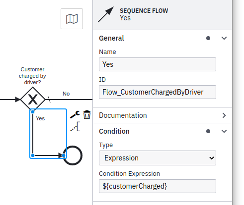
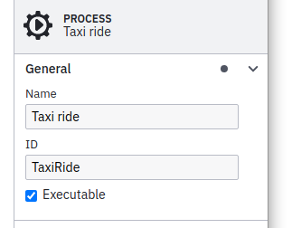
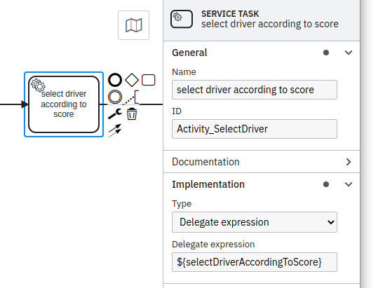
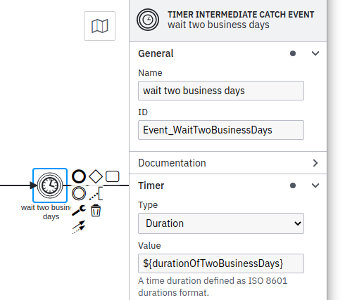

# SPI

This module is about the Blueprint SPI **which is a service programming interface for BPMS as a Java developer would expect it to be**.

It incorporates various state-of-the-art techniques and concepts to simplify business-process applications. This includes Domain-Driven design aspects, loose-coupling, aspect-orientated programming and "convention over configuration". All this helps to minimize the weaving between the BPMN and the business software.

## Content

1. [Paradigms](#paradigms)
1. [Concept](#concept)
1. [Usage](#usage)
   1. [Process-specific domain-aggregate](#process-specific-domain-aggregate)
   1. [Natural ids](#natural-ids)
   1. [Start a workflow](#start-a-workflow)
   1. [Correlate an incoming message](#correlate-an-incoming-message)
   1. [Wire up a process](#wire-up-a-process)
   1. [Wire up a task](#wire-up-a-task)
   1. [Wire up an expression](#wire-up-an-expression)
   
## Paradigms

Due to the nature that this SPI is an abstraction of BPMS-APIs it does not expose all features of a particular BPMS provides. But we think that this is more an advantage than a disadvantage since:

From a developer and product owner perspective:

- The BPMS' technology is *NOT* interwoven with the business code.
- Developers do *NOT* need to know about details of the BPMS.
- Any Java developer can write business processing software with no training required.
- The business code is readable and therefore easier to maintain.
- The business code is only about the implementation of the business requirements.
- Moving to other technology stacks (either for the BPMNs as well as for the business processing software itself) does not effect the business code.

From a product owner's perspective a BPMS should:

- Architecture: Implement a runtime concept fitting to the business software requirements:
   - embedded/remote engine
   - db-based/cloud-storage based
   - limited scalability/horizontal scaling
   - etc.
- Business: Keep the expenses for operation within the limits of the particular use case:
   - from small internal application
   - to big scale international selling platform.
- Operational: The complexity for operation should match the complexity of the particular use case:
   - How many components are required to run and maintain the BPMS?
   - How many technologies are introduced by the BPMS which are new to the operations/DevOps team?
   - Can the BPMS be run on top of technology already known by the operations/DevOps team?
   - Will this use-case bring me money to sanctify the BPMS' technology stack?

From a designer perspective:

- Designing the BPMN should not require any developer skills.
- Designing the BPMN should not require knowledge about the underlying implementation.
- The BPMN should not include any details of implementation (e.g. data structure).
- The requirements of the BPMN to the underlying business software implementation ("contract") should be able to be formulated by business people without support of developers.
- Evolving the BPMN has to be possible without development knowledge.

## Concept

Imagine you have to implement the business processing software of a taxi ride.

*How will the code be structured?*

The base idea is to implement a small group of service beans which are responsible to implement all requirements of a particular business process.

If external services or components are required then those service beans act as a frontend for all of them to not bind third-party dependencies close to the BPMN. This will ensure that changes in those external dependencies will be highlighted by the compiler and not only at runtime.

*How many services do you need to implement?*

In the best case only one service bean is sufficient. One workflow implemented by one service bean!

In case of more complex processes typically sections of fulfillment can be identified (determine a driver, do the ride, handle payment, etc.) which can be used as semantical buckets mapped to separate service beans.

*How are those service beans wired to the BPMN?*

In terms of BPMN there are tasks (e.g. service-task, send-task, etc.) which are wired to methods of that service by name and there are expressions (e.g. conditional-flows) which are evaluated against a process-specific [domain-aggregate](https://martinfowler.com/bliki/DDD_Aggregate.html) (see *How is data handled?*).

All those names used to wire tasks or expressions should be in a natural language camel-case style and therefore defined by the BPMN designer (BPMN-first approach) or upfront by the developer (software-first approach). This should on one hand force the BPMN designer to name the expected data/behavior and on the other hand help developers to understand what they have to implement. 

The sum of those names forms the contract between the BPMN and the underlying implementation. As an example these are typical names used as part of a taxi ride workflow:

- RideBooked (message name)
- determinePotentialDrivers (service task)
- requestRideOfferFromDriver (send task)
- noRideAvailable (aggregate property)
- customerCharged (aggregate property)

*How is data handled?*

A domain aggregate is used as a persistent entity to store data either required by the process to execute (e.g. as part of expressions) or by the underlying implementation to fulfill tasks. This aggregate does not keep all the data ever needed by the workflow but stores at least references to retrieve required values on demand.

If particular attributes are required often (e.g. nearly every task) then this aggregate can be used as a *cache* of the original source of data. Depending on the use-case one might has to implement a proper update strategy.

## Usage

### Process-specific domain-aggregate

Typically, you have data needed to fulfill the purpose of the process. This might be values like customer ID, order ID or in case of the taxi ride the pickup time, the pickup location and the target location:

```java
@Entity
@Table(name = "RIDES")
@Getter
@Setter
public class Ride {
  private OffsetDateTime pickupTime;
  private String pickupLocation;
  private String targetLocation;
  private boolean customerCharged;
}
```

This data has a 1:1 relationship to a particular workflow (a running instance of a process). This Blueprint uses a dedicated JPA entity per workflow for storing those values. This entity might be split up into a couple of sub-entities (many-to-many, one-to-many, many-to-one relations and embedded objects) but the root of that entity-tree is the record connected to the workflow. In terms of DDD this entire tree is called *an aggregate*.

#### Process variables

If you are familiar with any BPMS then you might know about process-variables you can use to store information the workflow needs to fulfill decisions like at sequence-flow conditions. This Blueprint does not use process-variables but makes the BPMS [use the domain-aggregate instead](#wire-up-an-expression):



Reasons for not using process-variables:

1. BPMN
   1. Process variables have no schema and therefore they cannot be documented and tested easily
   2. Using process variables, the "contract" between your BPMN model and your code can become quite intransparent
   3. No type-safety with regards to the information needed by the process
   4. Tight-coupling of the code and the business process definition
2. Operation of workflows
   1. Historic process-variables need to be cleaned up in order not to exhaust your database (even for cleaning-up itself!)
   2. Process-variables tend to pollute the execution context because typically they are not cleaned up by developers. The longer the process is running the more unused variables are stored.
   3. For call-activities, *all* process-variables are copied as a default, even including the temporary and unused variables mentioned above.
   4. Schema evolution: Process variables may have complex types and evolve over time. Migrating such values is a hard job.

#### Natural ids

The aggregate uses a natural id as a primary key, so for one specific natural key a particular process started twice is identified as a duplicate and rejected.

A natural id is a primary key which uniquely identifies a single business-case. That might be an order-id, a trouble-ticket-id or or a checksum calculated based on the use-case's attributes.

This natural id has to be chosen wisely, because it is used to identify duplicate requests, which might occur in a distributed, fault-tolerant system. It is also fine to use an auto-increment/UUID but in this case de-duplication will not work.

### Start a workflow

There is a ready-to-use service bean available called `ProcessService`. It is a generic bean using the workflow aggregate's class as a generic parameter and can be injected in any Spring component:

```java
    @Autowired
    private ProcessService<Ride> rideService;
```

To start a workflow (a running instance of a process) we can use it as part of a typical bean method which my be called due to a business event (e.g. user hits a button):

```java
    public void rideBooked(RideRequest request) {
         // use the request to initialize the aggregate
         var ride = new Ride(request);
         // start the process
         rideService.startProcess(ride);
    }
```

### Correlate an incoming message

Some BPMN elements are meant to wait for external messages like receive tasks and message catch events. The content of the message is typically incorporated into the domain aggregate to be used by upcoming tasks.

However, the event of the incoming message is also used to make the workflow wake up and process whatever comes after the "sleeping" receive task. This mechanism is called message correlation and is based on the message's name registered for the receive task.

One can use the `ProcessService` to perform that message correlation:

```java
    @Autowired
    private RideRepositories rides;
    
    public void confirmRide(RideConfirmation message) {
         ride = rides.get(message.getRideId());
         ride.setDriver(message.getDriverId());
         rideService.correlateMessage(ride, message);
    }
```

*Hint:* If the message correlates to a message start event, then a new workflow is created.

Additionally, if there are several receive tasks "waiting" for the same message then you need to define a correlation-id as a third parameter of `correlateMessage`.

### Wire up a process

Starting a workflow or correlating a message are actions originated in our custom business code typically triggered by some kind of business event (e.g. user hits a button). Wiring a process, a task or an expression is about connecting BPMN elements to our software components. In these situations the action to run our business code is initiated by the BPMS. So, we have to introduce markers to let the engine know where to find the right code to run.

According to the [concept](#concept) and in order to have no reference from BPMN to the implementation a name based approach is used for the binding in an aspect-oriented style.

As a basis for this binding the BPMN process-id is used:



#### Software-first approach

Developers might want to use a BPMS to improve readability or maintainability of the software since this takes a lot of coding away. In this situation the service bean might be created upfront.

Use the service's class-name as the process BPMN's process-id to wire up the component to the process by simply adding the `@WorkflowService` annotation:

```java
@Component
@WorkflowService(workflowAggregateClass = Ride.class)
public class TaxiRide {
  ...
}
```

The mandatory annotation attribute `workflowAggregateClass` references the class used as domain-aggregate of this workflow.

#### BPMN-first approach

In case of a given BPMN file the component needs to be mapped by setting the `bpmnProcess` attribute if it is not the same string as the class-name:

```java
@Component
@WorkflowService(
        workflowAggregateClass = Ride.class,
        bpmProcess = @BpmnProcess(bpmnProcessId = "Process_TaxiRide")
    )
public class TaxiRide {
  ...
}
```

If the service-bean becomes huge due to the number of tasks of the workflow then multiple service-beans can be annotated with the same `@WorkflowService` annotation. The only precondition for this is to avoid duplicate task wiring. However, if there is a method wired twice this will be detected on startup and reported by throwing an exception.

#### Versioning of BPMN business-processes

In case of doing breaking changes in BPMN over the time you can specify for which versions of BPMN this component is developed for:

```java
@Component
@WorkflowService(
        workflowAggregateClass = Ride.class,
        version = "<10"
    )
public class TaxiRide {
  ...
}
```

Valid formats:
* missing attribute: all versions
* '*': all versions
* '1': only version "1"
* '1-3': only versions "1", "2" and "3"
* '<3': only versions "1" and "2"
* '<=3': only versions "1", "2" and "3"
* '>3': only versions higher then "3"
* '>=3': only versions higher then or equal to "3"

#### Call-activities

There are two different ways to treat call-activities:

##### 1. Decomposition - a call-activity is used to hide complexity

In this situation the workflow-aggregate entity created for the root workflow is also used for the workflows spawned by call-activities. The reason for this is, that one still could put the content of the call-activities process into to parent process (e.g. as an embedded subprocess).

As each call-activity's process is a section of fulfillment one should introduce a separate service bean bound to the same workflow-aggregate domain-entity:

```java
@Component
@WorkflowService(
        workflowAggregateClass = Ride.class,
        bpmnProcess = @BpmnProcess(bpmnProcessId = "DetermineDriver"))
public class DetermineDriver {
  ...
}
```

*Hint:* In this example the attribute bpmnProcess could be removed since the BPMN process-id is the same as the service's class-name ("convention over configuration").

But one can also decide to reuse the existing service-bean for the call-activity's process by simply adding another `@BpmnProcess` annotation:

```java
@Component
@WorkflowService(
        workflowAggregateClass = Ride.class,
        bpmProcess = {
            @BpmnProcess(bpmnProcessId = "TaxiRide"),
            @BpmnProcess(bpmnProcessId = "DetermineDriver")
        })
public class TaxiRide {
  ...
}
```

*Hint:* In this example the attribute bpmnProcess of the first @BpmnProcess annotation could be removed since the BPMN process-id is the same as the service's class-name ("convention over configuration").

##### 1. Reuse - a call-activity is used to reuse a section of a process by other processes, too

In this situation the call-activity's process is used in different contexts of different parent-processes. Therefore also a separate workflow-aggregate domain-entity has to be defined and used.

In order to support this notion the target process is not modeled as a call-activity but as a collapsed pool. Instead of a call-activity a service task is used in the BPMN.

```java
@Component
@WorkflowService(workflowAggregateClass = Payment.class)
public class ChargeCreditCard {
  ...
}
```


### Wire up a task

According to the [concept](#concept) and in order to have no reference from BPMN to the implementation an aspect-oriented approach is used for the binding. This kind of wiring is used for service tasks, send tasks, business rule tasks and user tasks.



The `@WorkflowTask` annotation is used to mark a method responsible for certain BPMN task:

```java
@WorkflowTask
public void selectDriverAccordingToScore(Ride ride) {
  ...
}
```

#### Software-first approach

In this situation for the name of the BPMN task definition the name of the method has to be used (e.g. `selectDriverAccordingToScore`) as shown in the screenshot above:

```java
@WorkflowTask
public void selectDriverAccordingToScore(Ride ride) {
  ...
}
```

#### BPMN-first approach

If the BPMN is given, then the name used in the BPMN can be mapped by the annotation attribute `taskDefinition` if it does not match the method's name:

```java
@WorkflowTask(taskDefinition = "SELECT_DRIVER")
public void selectDriverAccordingToScore(Ride ride) {
  ...
}
```

as an alternative the task can be wired by the task's BPMN id:

```java
@WorkflowTask(id = "Activity_SelectDriver")
public void selectDriverAccordingToScore(Ride ride) {
  ...
}
```

#### Domain-entity argument

```java
@WorkflowTask
public void selectDriverAccordingToScore(Ride ride) {
  ...
}
```

As mentioned in section [Process-specific domain-aggregate](#process-specific-domain-aggregate) for each workflow a JPA entity-record is used as a domain-aggregate. So, whenever a service-method is called there is one parameter accepted: The domain-aggregate providing values of the current workflow.

Therefore these workflow task methods do not return any value since they operate on the given data from the domain-aggregate and also store new data in the domain-aggregate if necessary.

#### Multi-instance

For multi-instance executions typically a lot of process variables are created automatically:

1. The current element of the collection
1. The number of index of the current element
1. The total number of elements

To avoid problems on serializing and deserializing elements:

1. Don't use collection values for multi-instance activities.
1. Use attribute `loop-cardinality` instead to simply define the number of iterations.
1. In case of dynamically changing collections use attribute `completionCondition`.
1. Fetch the current element on your own based on the current iteration's index.

Especially the last item is important: If you ask the process engine to handle the collection to retrieve the current element it might be that this is not done in the most efficient way, since the process engine does not know about the details of the underlying data (typically the workflow-aggregate). Therefore it is better to fetch the element as part of the method the iteration is used for.

##### Tasks

In case of multi-instance the current element (for collection-based tasks), the current iteration's number and the total number of elements (for cardinality-based tasks) can be passed to any method called.

To announce which values you are interested in, add further method-parameters annotated by one of these annotations:
* `@MultiInstanceElement` to pass the current element
* `@MultiInstanceIndex` to pass the current iterations index
* `@MultiInstanceTotal` to pass the total number of iterations

*Cardinality-based:*

```java
@WorkflowTask
public void requestRideOfferFromDriver(Ride ride,
    @MultiInstanceIndex int index) {
  final var driver = ride.getDrivers().get(index);
  ...
}
```

*Collection-based:*

```java
@WorkflowTask
public void requestRideOfferFromDriver(Ride ride,
    @MultiInstanceElement String driverId) {
  ...
}
```

##### Embedded subprocesses

For multi-instance embedded-subprocesses the iteration is used at tasks within that embedded-subprocess. For method parameters annotated by `@MultiInstanceIndex`, `@MultiInstanceTotal` or  `@MultiInstance` the values of the first multi-instance parent activity are passed to the business method.

*Nested multi-instance activities*:

One can design processes having more than one multi-instance context active:
* Multi-instance task within a multi-instance embedded sub-process
* Multi-instance task within a multi-instance call-activity
* Task within a multi-instance call-activity within a multi-instance embedded-subprocess
* etc.

To handle these complex situations a `MultiInstanceElementResolver` bean can be specified as part of the annotation `@MultiInstanceElement`:

```java
@WorkflowTask
public void cancelRideOfferOfDriver(Ride ride,
    @MultiInstanceElement(resolver = DriverResolver.class) Driver driver) {
  ...
}
```

A Spring-bean implementing the resolver class is used to convert the current multi-instance execution-context into an object used by the business-method. Using this technique hides the complexity and makes it reusable for different activities within the same BPMN-context. A resolver has to implement the interface `MultiInstanceElementResolver`.

Example:

```java
@Component
public class DriverResolver implements MultiInstanceElementResolver<Ride, Driver> {
    @Autowired
    private DriversService drivers;
    
    public ProductLicense resolve(Ride ride,
            Map<String, MultiInstance<Object>> nestedMultiInstanceContext) {
            
        String driverId = nestedMultiInstanceContext
                .get("RequestRideOffer").getElement();
        String index = nestedMultiInstanceContext
                .get("CancelNotRequiredRide").getIndex();
        
        return drivers.getDriverByIdAndIndex(driverId, index);
    }
}
```

In this example the element of the collection based 'RequestRideOffer' multi-instance embedded subprocess is used next to the index of the nested multi-instance 'CancelNotRequiredRide'. Both values are passed to the internal 'DriverService' to determine the required driver entity.

### Wire up an expression

There are two major situations in which expressions are used:

1. A path decision has to be taken (exclusive gateway, inclusive gateway, conditional flows)
1. A value needs to be calculated (e.g. x business-days as a timer-event definition) 

In both cases a getter method of the domain-aggregate is used to retrieve the value.

*Hint:* Each [BPMS-specific adapter](../adapters/README.md#engine-adapters) implements this *magic* to redirect attribute references in BPMN expressions to the proper getter of your domain-aggregate.
