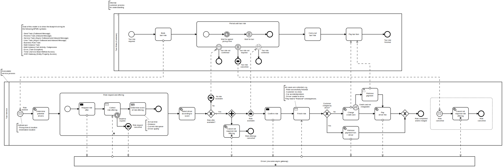

# Taxi ride show case

This is a full fledged example showing the usage of various things implemented by the blueprint:

1. **A Spring boot microservice container** capable to host more than one independent workflow module.
1. **One encapsulated workflow module** implementing the taxi ride process.
1. Another Spring boot **container which simulates bounded systems** to be used for local development and integration tests.
1. A [driver service](./driver-service-api/README.md) **REST API** which is used by the ride process as a client and provided as a service by the simulation container.

